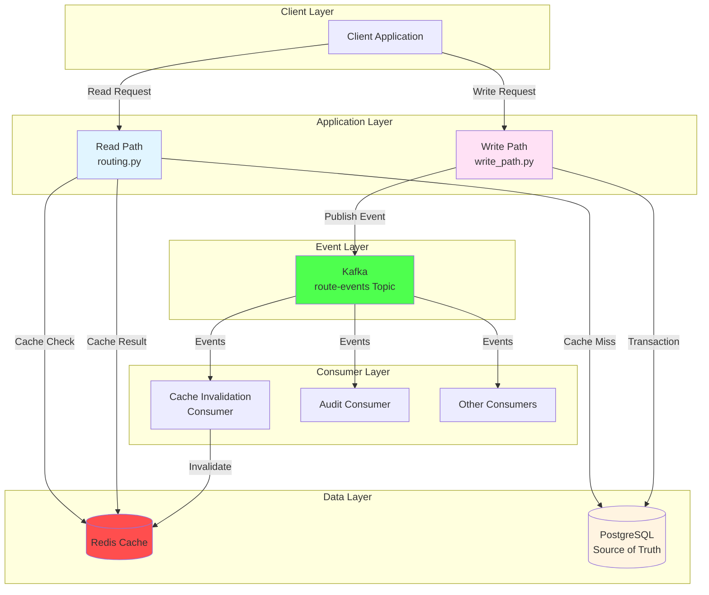

# Traffic Manager - Architecture Diagrams

This file contains Mermaid diagrams visualizing the Traffic Manager architecture.

## 1. System Architecture Overview

## 2. Read Path Flow

## 3. Write Path Flow

## 4. Database Schema Relationships

## 5. Component Interaction Diagram

## 6. Event Flow Diagram

## 7. Consistency Model Diagram

## 8. Failure Scenarios

## 9. Scalability Model

## 10. Metrics and Observability

## 11. Cache Strategy Flow

## 12. Idempotency Model

## How to View These Diagrams

These Mermaid diagrams can be viewed in:

1. **GitHub/GitLab**: Rendered automatically in markdown files
2. **VS Code**: Install "Markdown Preview Mermaid Support" extension
3. **Online**: Copy diagram code to [Mermaid Live Editor](https://mermaid.live/)
4. **Documentation Tools**: Most modern documentation platforms support Mermaid

## Diagram Legend

- **Blue boxes**: Read path components
- **Pink boxes**: Write path components
- **Yellow boxes**: Database/storage
- **Red boxes**: Cache
- **Green boxes**: Event/messaging systems
- **Light colors**: Application components
- **Dark colors**: Infrastructure components
